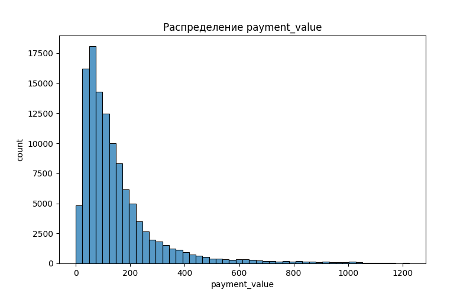
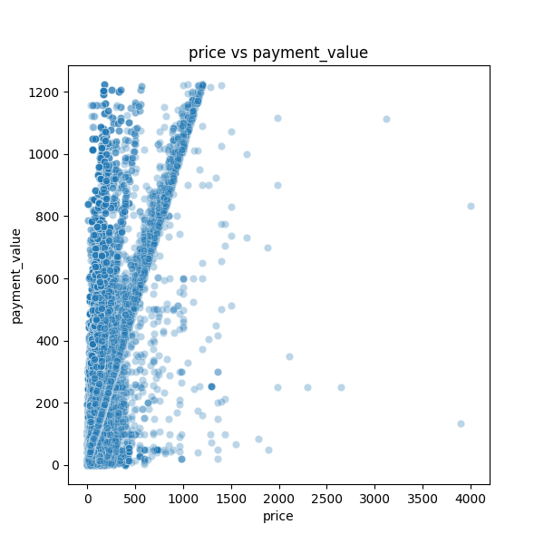
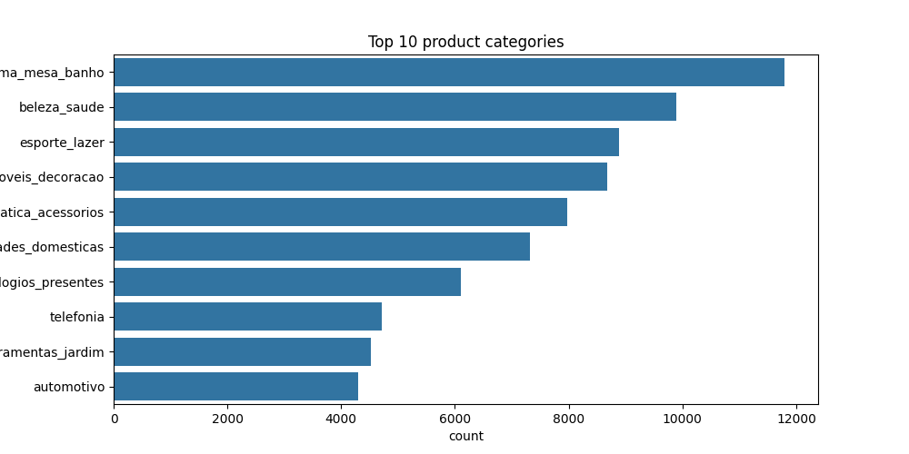
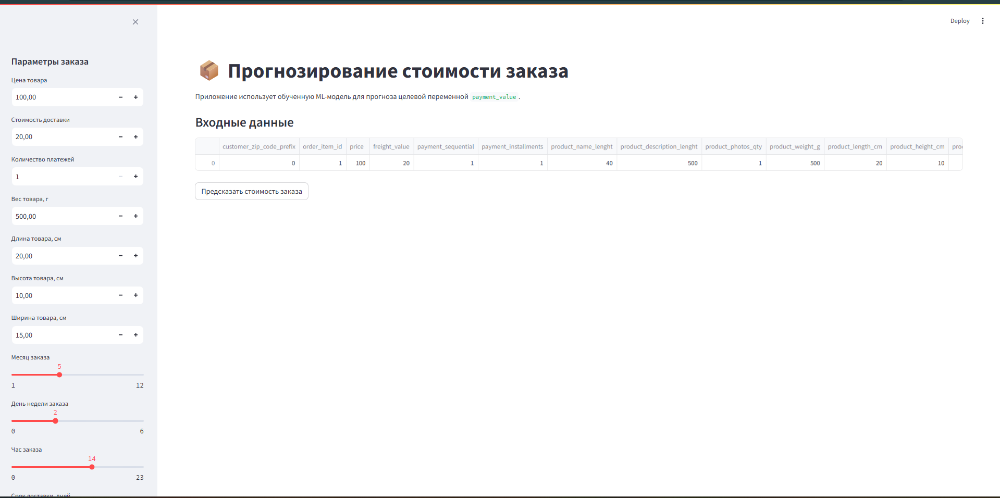
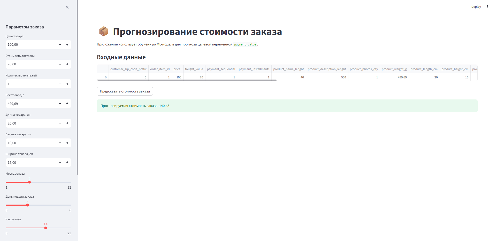

# Отчёт по проекту

Студент: Сущенко Илья Денисович  
Группа: БИВ 237

---

## 1. Введение и постановка задачи

Цель проекта — предсказать стоимость заказа (`payment_value`) на основе информации о заказе, товаре, оплате, продавце и доставке.

Задача относится к регрессии, так как целевая переменная является числовой.

Практическая ценность проекта заключается в возможности прогнозировать стоимость заказов, что может быть полезно для анализа продаж, оценки поведения покупателей и оптимизации бизнес-процессов интернет-магазина.

Основная метрика качества — **RMSE**. Она выбрана основной, потому что показывает средний размер ошибки прогноза в единицах целевой переменной и сильнее штрафует крупные ошибки. Для задачи прогнозирования стоимости заказа это важно, так как большие ошибки в денежных значениях могут быть более критичны для бизнеса.

Дополнительно используются:

- **MAE** — показывает среднюю абсолютную ошибку и легче интерпретируется в денежных единицах;
- **R2** — показывает долю объяснённой дисперсии и позволяет оценить общее качество модели.

Приоритет метрик следующий: основной критерий выбора модели — минимальный RMSE, затем дополнительно анализируются MAE и R2.

---

## 2. Поиск и описание данных

Источник данных: Kaggle — Brazilian E-Commerce Public Dataset by Olist.  
Ссылка на датасет: https://www.kaggle.com/datasets/olistbr/brazilian-ecommerce

Датасет был выбран, так как содержит реальные данные интернет-магазина:

- заказы;
- товары;
- платежи;
- продавцы;
- покупатели;
- информацию о доставке.

В проекте использовались следующие исходные таблицы:

- `olist_customers_dataset.csv`;
- `olist_orders_dataset.csv`;
- `olist_order_items_dataset.csv`;
- `olist_order_payments_dataset.csv`;
- `olist_products_dataset.csv`;
- `olist_sellers_dataset.csv`;
- `product_category_name_translation.csv`.

После объединения исходных таблиц был получен общий датасет. Затем были отобраны признаки, подходящие для задачи прогнозирования стоимости заказа.

После финальной обработки итоговый датасет содержит:

- 117250 строк;
- 27 столбцов;
- 26 признаков;
- 1 целевую переменную `payment_value`.

Итоговый файл сохранён по пути:

`data/processed/final_dataset.csv`

---

## 3. Обработка и подготовка данных

### Очистка данных

На этапе подготовки данных были выполнены следующие действия:

- объединены исходные таблицы Olist;
- проверены и обработаны пропуски;
- проверены и удалены дубликаты;
- обработаны даты заказа и доставки;
- удалены лишние идентификаторы и текстовые поля;
- выбраны числовые признаки;
- удалены выбросы по целевой переменной с помощью 99-го перцентиля;
- сформирован итоговый датасет для моделирования;
- целевая переменная `payment_value` исключена из признаков.

### Контроль утечки данных

При объединении таблиц учитывалось, что один заказ может иметь несколько товаров и несколько платежей. Поэтому после объединения проверялось появление повторяющихся строк и контролировалось, чтобы целевая переменная `payment_value` не использовалась как входной признак модели.

Train/test split выполнялся после формирования итогового датасета. Все модели обучались и сравнивались на одинаковом наборе признаков. Целевая переменная `payment_value` исключалась из признаков перед обучением.

Признаки, напрямую рассчитанные из `payment_value`, не добавлялись, чтобы избежать data leakage.

### Feature engineering

Для повышения качества модели были созданы дополнительные признаки:

- `order_purchase_month` — месяц оформления заказа;
- `order_purchase_dayofweek` — день недели оформления заказа;
- `order_purchase_hour` — час оформления заказа;
- `approval_days` — время до подтверждения заказа;
- `delivery_days` — фактическое время доставки;
- `delivery_delay_days` — отклонение фактической даты доставки от ожидаемой;
- `shipping_limit_days` — срок до лимита отправки;
- `product_volume_cm3` — объём товара;
- `product_density` — плотность товара;
- `freight_to_price_ratio` — отношение стоимости доставки к цене товара;
- `total_item_cost` — сумма цены товара и доставки;
- `price_per_weight` — цена на единицу веса товара.

Целевая переменная `payment_value` используется только как target. Она не входит в признаки модели и не используется при создании новых признаков, чтобы избежать утечки данных.

### Используемые признаки

В финальный датасет вошли исходные числовые признаки и признаки, созданные на этапе feature engineering. Основные признаки:

- `customer_zip_code_prefix`;
- `order_item_id`;
- `price`;
- `freight_value`;
- `payment_sequential`;
- `payment_installments`;
- `product_name_lenght`;
- `product_description_lenght`;
- `product_photos_qty`;
- `product_weight_g`;
- `product_length_cm`;
- `product_height_cm`;
- `product_width_cm`;
- `seller_zip_code_prefix`;
- `order_purchase_month`;
- `order_purchase_dayofweek`;
- `order_purchase_hour`;
- `approval_days`;
- `delivery_days`;
- `delivery_delay_days`;
- `shipping_limit_days`;
- `product_volume_cm3`;
- `product_density`;
- `freight_to_price_ratio`;
- `total_item_cost`;
- `price_per_weight`.

Целевая переменная:

- `payment_value`.

### Визуализации

Были построены:

- гистограммы распределения целевой переменной;
- boxplot;
- scatter plot для анализа связи `price`, `freight_value` и `payment_value`;
- корреляционная матрица;
- график популярных категорий товаров.

Выявлено:

- распределение `payment_value` имеет правостороннюю асимметрию;
- большинство заказов имеют относительно небольшую стоимость;
- признаки `price` и `freight_value` связаны с целевой переменной;
- в данных присутствуют крупные значения, влияющие на ошибку прогноза;
- ансамблевые модели деревьев лучше учитывают нелинейные зависимости в данных.

### Примеры визуализаций

#### Распределение целевой переменной



Распределение `payment_value` имеет сильную правостороннюю асимметрию: большинство заказов имеют небольшую стоимость, при этом присутствует длинный хвост из крупных значений.

---

#### Связь цены и стоимости заказа



Наблюдается положительная зависимость: с ростом цены товара увеличивается итоговая стоимость заказа. Это ожидаемо, так как цена товара напрямую влияет на итоговый платёж.

---

#### Популярные категории товаров



Наиболее популярные категории товаров представлены на графике. Это помогает оценить структуру спроса в интернет-магазине.

---

### Сплит данных

Использован train/test split:

- 80% train;
- 20% test;
- `random_state=42`.

Размеры выборок:

- Train: 93800 объектов;
- Test: 23450 объектов.

Train/test split выполнялся после полной предобработки итогового датасета. Это позволило сравнивать все модели в одинаковых условиях. Целевая переменная `payment_value` была исключена из признаков до обучения моделей.

### Уменьшение размерности

Методы уменьшения размерности не применялись, так как после отбора и подготовки данных количество признаков осталось небольшим. Использование PCA в данном случае могло ухудшить интерпретируемость признаков без гарантированного улучшения качества модели.

---

## 4. Baseline-модель

В качестве baseline использовалась модель Linear Regression.

Baseline-модель обучалась на тренировочной выборке и оценивалась на тестовой выборке.

Результаты baseline:

| Модель | RMSE | MAE | R2 |
|---|---:|---:|---:|
| Linear Regression | 87.4126 | 40.2400 | 0.7014 |

Baseline используется как точка отсчёта для сравнения с более сложными моделями. Если более сложная модель показывает RMSE ниже baseline, значит она лучше справляется с задачей прогнозирования стоимости заказа.

---

## 5. Моделирование и эксперименты

На этапе CP2 были обучены и сравнены несколько моделей машинного обучения для задачи регрессии.

Были использованы следующие модели:

- Linear Regression;
- Ridge;
- Lasso;
- Random Forest;
- Gradient Boosting;
- Extra Trees;
- Ridge tuned;
- Gradient Boosting tuned;
- Random Forest tuned.

Для всех моделей использовался единый пайплайн:

- заполнение пропусков с помощью `SimpleImputer`;
- масштабирование признаков с помощью `StandardScaler`;
- обучение модели;
- оценка на тестовой выборке.

Для улучшения качества были выполнены эксперименты с подбором гиперпараметров:

- для Ridge подбирался параметр `alpha`;
- для Gradient Boosting подбирались `n_estimators`, `learning_rate`, `max_depth`, `min_samples_split`;
- для Random Forest подбирались `n_estimators`, `max_depth`, `min_samples_split`, `min_samples_leaf`.

Основной метрикой оптимизации был RMSE.

### Результаты экспериментов

| Модель | RMSE | MAE | R2 |
|---|---:|---:|---:|
| Extra Trees | 65.5815 | 28.7206 | 0.8319 |
| Gradient Boosting tuned | 65.6167 | 28.1228 | 0.8318 |
| Random Forest tuned | 65.7032 | 27.4990 | 0.8313 |
| Random Forest | 66.0288 | 28.8796 | 0.8296 |
| Gradient Boosting | 66.5757 | 28.6140 | 0.8268 |
| Linear Regression | 87.4126 | 40.2400 | 0.7014 |
| Ridge tuned | 87.4128 | 40.2396 | 0.7014 |
| Ridge | 87.4140 | 40.2262 | 0.7014 |
| Lasso | 87.4723 | 39.8712 | 0.7010 |

Лучшей моделью по основной метрике RMSE стала `Extra Trees`.

Она показала:

- RMSE: 65.5815;
- MAE: 28.7206;
- R2: 0.8319.

По сравнению с baseline-моделью Linear Regression качество заметно улучшилось:

- RMSE уменьшился с 87.4126 до 65.5815;
- MAE уменьшился с 40.2400 до 28.7206;
- R2 вырос с 0.7014 до 0.8319.

После подбора гиперпараметров качество Gradient Boosting и Random Forest также улучшилось, однако минимальное значение RMSE показала модель Extra Trees. Поэтому именно она выбрана финальной моделью.

---

## 6. Финальная модель и воспроизводимость

Финальной моделью выбрана `Extra Trees`, так как она показала минимальное значение RMSE на тестовой выборке.

Выбор финальной модели обоснован следующими причинами:

- модель показала минимальный RMSE среди всех экспериментов;
- R2 у модели также оказался максимальным среди сравниваемых моделей;
- качество заметно лучше baseline-модели Linear Regression;
- ансамблевые деревья лучше учитывают нелинейные зависимости между признаками и стоимостью заказа.

Финальная модель сохранена в файл:

`models/best_model.joblib`

Файл с результатами экспериментов сохранён по пути:

`models/results.csv`

Для воспроизводимости проекта подготовлены:

- `src/preprocessing.py` — скрипт предобработки данных;
- `src/train.py` — скрипт обучения и оценки моделей;
- `requirements.txt` — список зависимостей;
- `Dockerfile`;
- `docker-compose.yml`;
- `tests/test.py` — тесты пайплайна.

Запуск предобработки:

```
python src/preprocessing.py
```

Запуск обучения:

```
python src/train.py
```

Запуск тестов:

```
python -m pytest tests
```

Для контроля воспроизводимости были добавлены автоматические тесты. Они проверяют наличие итогового датасета, целевой переменной, основных признаков, отсутствие пропусков, наличие feature engineering-признаков, корректность файла с результатами, сохранение финальной модели и возможность выполнения предсказания.

Результат тестирования:

```
15 tests passed
```

Проверка качества кода с помощью Ruff:

```
ruff check src tests --line-length 120
```

Результат проверки:

```text
All checks passed
```

Для обеспечения воспроизводимости используется фиксированный `random_state=42`.

---

## 7. Деплой

Для демонстрации работы финальной модели было реализовано Streamlit-приложение `app.py`.

Выбор Streamlit обусловлен тем, что этот инструмент позволяет быстро создать простой веб-интерфейс для ML-модели без необходимости разрабатывать отдельный backend и frontend. Такой формат подходит для демонстрации работы модели пользователю и проверки инференса на новых данных.

Приложение загружает сохранённую модель из файла:

`models/best_model.joblib`

Пользователь вводит параметры заказа, товара и доставки:

- цена товара;
- стоимость доставки;
- количество платежей;
- вес товара;
- размеры товара;
- месяц, день недели и час оформления заказа;
- срок доставки;
- задержка доставки;
- срок подтверждения заказа;
- срок до лимита отправки.

На основе введённых данных дополнительно рассчитываются признаки, созданные на этапе feature engineering:

- `product_volume_cm3`;
- `product_density`;
- `freight_to_price_ratio`;
- `total_item_cost`;
- `price_per_weight`.

После нажатия кнопки приложение формирует датафрейм с признаками, передаёт его в модель и выводит прогнозируемое значение `payment_value`.

Запуск приложения выполняется командой:

```
python -m streamlit run app.py
```

После запуска приложение открывается в браузере по адресу:

```
http://localhost:8501
```

Также проект можно запустить через Docker:

```
docker-compose up --build
```

### Скриншоты работы приложения

Главная страница приложения:



Результат предсказания:



### Видео демонстрации

Видео демонстрации работы приложения: [ссылка на видео](https://disk.yandex.ru/d/_wU-As6XxRawYg)

Таким образом, для проекта был реализован локальный деплой модели в виде веб-приложения. Пользователь может ввести параметры заказа и получить прогноз стоимости без запуска кода обучения вручную.

---

## 8. Заключение и выводы

В ходе работы над проектом была решена задача регрессии — прогнозирование стоимости заказа `payment_value` на основе данных о заказе, товаре, оплате, продавце и доставке.

В рамках проекта были выполнены следующие этапы:

- найден и описан датасет Brazilian E-Commerce Public Dataset by Olist;
- выполнено объединение исходных таблиц;
- проведена очистка данных;
- обработаны пропуски и дубликаты;
- удалены выбросы по целевой переменной;
- добавлены признаки feature engineering;
- подготовлен итоговый датасет `data/processed/final_dataset.csv`;
- обучена baseline-модель;
- проведены эксперименты с несколькими алгоритмами машинного обучения;
- выполнен подбор гиперпараметров для Ridge, Gradient Boosting и Random Forest;
- выбрана финальная модель;
- сохранены результаты экспериментов;
- сохранена лучшая модель в формате `.joblib`;
- добавлены автоматические тесты;
- реализован локальный деплой через Streamlit;
- подготовлен воспроизводимый запуск через Python-скрипты и Docker.

Лучшей моделью стала **Extra Trees**, которая показала наименьшее значение RMSE — **65.5815**.

По сравнению с baseline-моделью Linear Regression качество заметно улучшилось:

- RMSE уменьшился с 87.4126 до 65.5815;
- R2 вырос с 0.7014 до 0.8319.

Основные выводы:

- линейные модели дают похожее качество и уступают ансамблевым методам;
- Random Forest, Extra Trees и Gradient Boosting заметно улучшают качество прогноза;
- Extra Trees оказалась лучшей моделью по RMSE и R2;
- признаки `price`, `freight_value`, `total_item_cost`, а также признаки, связанные с товаром и доставкой, важны для прогнозирования стоимости заказа;
- feature engineering позволил добавить более информативные признаки;
- сохранение модели в `.joblib` позволяет повторно использовать её без переобучения;
- Streamlit-приложение позволяет использовать модель через простой веб-интерфейс;
- автоматические тесты повышают воспроизводимость проекта и помогают проверить корректность пайплайна.

Ограничение проекта заключается в том, что модель обучалась на очищенных данных, где были удалены экстремальные значения целевой переменной. Поэтому для очень дорогих заказов качество прогноза может быть ниже, чем для типичных заказов из обучающей выборки.

В дальнейшем проект можно развивать за счёт:

- более глубокого подбора гиперпараметров;
- добавления категориальных признаков через кодирование;
- сравнения с XGBoost или LightGBM;
- добавления отдельного inference API на FastAPI;
- публикации приложения на удалённом сервере или облачной платформе.
